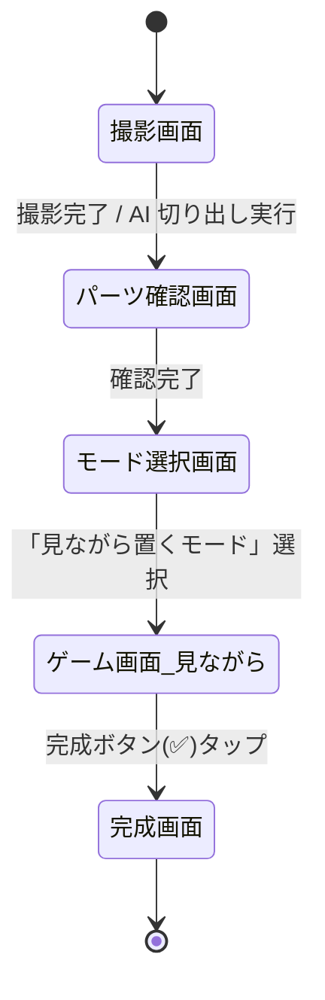
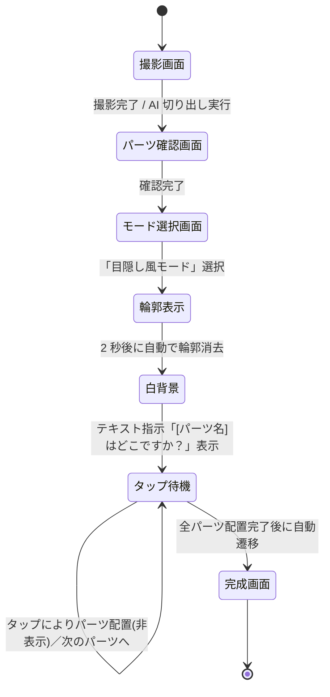

# 要件定義書 — face-puzzle

## §1. はじめに

### 1.1 目的

本文書は、face-puzzle アプリケーション(以降「本システム」)の要件を定義するものである。
本文書は開発の判断基準として機能し、後続のアーキテクチャ設計・実装フェーズの入力となる。

### 1.2 背景

家族が自宅で気軽に楽しめるデジタル福笑いゲームの需要から本プロジェクトが発足した。
特定の家族(夫)の顔写真を素材とし、幼児を含む家族が一緒に遊べることを最優先とする。

### 1.3 対象読者

本文書は、本システムの設計者・開発者および関係ステークホルダーを対象とする。

---

## §2. 用語定義

| 用語 | 定義 |
|---|---|
| 顔パーツ | AI によって顔写真から切り出された目・鼻・口・眉・耳等の部位画像 |
| 配置エリア | ユーザーが顔パーツを操作によって配置する画面上の領域 |
| 見ながら置くモード | のっぺらぼう画像を背景として参照しながらパーツをドラッグ配置できるモード |
| 目隠し風モード | 顔の輪郭提示後に背景を隠した状態で、テキスト指示に従いパーツをタップ配置するモード |
| のっぺらぼう画像 | 元顔写真から AI が切り出した顔パーツ領域を除去した背景画像。ゲーム画面および完成画面の背景として使用する |
| AI 顔検出 | 機械学習モデルにより写真中の顔領域・各パーツ座標を自動検出する処理 |
| SRS | Software Requirements Specification(ソフトウェア要件仕様書)の略 |
| FR | Functional Requirement(機能要件)の略 |
| NFR | Non-Functional Requirement(非機能要件)の略 |
| UC | Use Case(ユースケース)の略 |
| AC | Acceptance Criteria(成功判定基準)の略 |

---

## §3. システム概要

本システムは、スマートフォン上で動作するデジタル福笑いゲームアプリケーションである。
ユーザーがスマートフォンのカメラで撮影した顔写真を素材として、
AI が各顔パーツを自動切り出しし、画面上でパーツを自由に配置して遊ぶ体験を提供する。

---

## §4. ユーザー特性

### 4.1 主要ユーザー

| 属性 | 詳細 |
|---|---|
| 年齢層 | 保護者(成人)および 4 歳児 |
| IT スキル | 保護者:スマートフォン操作に習熟。幼児:文字読解不可、タップ・ドラッグの基本操作のみ可能 |
| 利用形態 | 2 名が同一端末を共有して共同操作する |
| 利用頻度 | 不定期(娯楽目的) |

### 4.2 利用場面

- 場所:自宅
- 時間帯:不定
- セッション時間:1 回あたり数分程度を想定
- ネットワーク:Wi-Fi 接続可能な環境を前提とする

---

## §5. 機能要件

### 5.1 ユースケース一覧

| ID | ユースケース名 | 主アクター |
|---|---|---|
| UC-001 | 顔写真を撮影する | 保護者 |
| UC-002 | AI が顔パーツを自動切り出しする | システム |
| UC-003 | 遊び方モードを選択する | 保護者・幼児 |
| UC-004 | 顔パーツを配置エリアに配置する | 保護者・幼児 |
| UC-005 | 完成した顔を確認する | 保護者・幼児 |

### 5.2 画面遷移

#### 見ながら置くモード

見ながら置くモードのゲーム画面では、のっぺらぼう画像を背景として常時表示する。
ユーザーは各パーツをドラッグ操作で任意の位置に配置し、完成ボタンで完成画面に遷移する。

#### 目隠し風モード

目隠し風モードのゲーム画面では、顔の輪郭(破線楕円)を 2 秒間提示した後に白背景へ切り替える。
パーツはテキスト指示に従いタップ一発で配置する。配置済みパーツはゲームプレイ中は非表示とし、
完成画面でのっぺらぼう画像上に初めて表示する。完成ボタンは使用しない。

### 5.3 機能要件詳細

#### FR-001: カメラ撮影

- 説明:本システムはスマートフォンの内蔵カメラを起動し、ユーザーが顔写真を撮影できる機能を提供しなければならない。
- 優先度:必須
- 関連 UC:UC-001

成功判定基準:

| ID | 判定基準 |
|---|---|
| AC-001 | カメラ起動ボタンを 1 タップでカメラが起動すること |
| AC-002 | 撮影した画像が本システム内に保持されること |

---

#### FR-002: AI 顔パーツ自動切り出し

- 説明:本システムは、撮影した顔写真に対して AI 顔検出処理を実行し、目・鼻・口・眉・耳を個別の画像パーツとして切り出さなければならない。
- 優先度:必須
- 関連 UC:UC-002

成功判定基準:

| ID | 判定基準 |
|---|---|
| AC-003 | 顔が 1 名含まれる写真に対して、主要パーツ(目×2、鼻×1、口×1)が切り出されること |
| AC-004 | 切り出し結果がユーザーに視覚的に提示されること |

---

#### FR-003: 遊び方モード選択

- 説明:本システムはゲーム開始前に「見ながら置くモード」と「目隠し風モード」の 2 択をユーザーに提示し、選択できる機能を提供しなければならない。
- 優先度:必須
- 関連 UC:UC-003

成功判定基準:

| ID | 判定基準 |
|---|---|
| AC-005 | モード選択画面で 2 つの選択肢が明示されること |
| AC-006 | 選択されたモードが以降のゲーム画面に反映されること |

---

#### FR-004: 顔パーツのドラッグ配置(見ながら置くモード限定)

- 説明:本システムは、見ながら置くモード選択時に限り、切り出した顔パーツをユーザーがタップおよびドラッグ操作によって配置エリア上の任意の位置に配置できる機能を提供しなければならない。目隠し風モードにおけるパーツ配置操作は FR-007 に定義する。
- 優先度:必須
- 関連 UC:UC-004
- 適用モード:見ながら置くモードのみ

成功判定基準:

| ID | 判定基準 |
|---|---|
| AC-007 | 各パーツが独立してドラッグ可能であること |
| AC-008 | 指を離した位置にパーツが定着すること |
| AC-009 | 配置済みパーツを再度ドラッグして移動できること |

---

#### FR-005: 完成顔の表示

- 説明:本システムは完成画面遷移時に、のっぺらぼう画像を背景として配置されたパーツを重畳表示し、最終的な顔として画面に表示しなければならない。見ながら置くモードでは完成ボタン(✅)タップを契機とし、目隠し風モードでは全パーツ配置完了を契機として完成画面へ自動遷移する。
- 優先度:必須
- 関連 UC:UC-005

成功判定基準:

| ID | 判定基準 |
|---|---|
| AC-010 | 完成画面への遷移後、のっぺらぼう背景上に全配置パーツが視覚的に確認できること |

---

#### FR-006: 見ながら置くモードにおける元画像の参照

- 説明:「見ながら置くモード」選択時、本システムはゲーム画面および完成画面の背景にのっぺらぼう画像を表示しなければならない。元画像をサムネイルとして別途表示する機能は提供しない。
- 優先度:必須
- 関連 FR:FR-003、FR-008

成功判定基準:

| ID | 判定基準 |
|---|---|
| AC-011 | 「見ながら置くモード」のゲーム画面および完成画面において、のっぺらぼう画像が背景として常時表示されること |

---

#### FR-007: 目隠し風モードのゲームフロー

- 説明:「目隠し風モード」選択時、本システムは以下のゲームフローを提供しなければならない。
  1. 白背景上に顔の輪郭を破線楕円として表示する。
  2. 輪郭表示から 2 秒後に破線を自動で消去し、完全な白背景に切り替える。
  3. 画面中央に「[パーツ名]はどこですか？」のテキスト指示を表示する。対象パーツの順序は向かって左の目・向かって右の目・鼻・口の順とする。パーツ名はユーザ(操作者)から見た方向を基準として表現し、被写体視点の「右目」「左目」という表現は使用しない。
  4. ユーザーが画面をタップした位置に当該パーツを配置する。配置済みパーツはゲームプレイ中は非表示とする。
  5. ステップ 3〜4 を残りパーツ分繰り返す。
  6. 全パーツの配置完了後、完成画面へ自動遷移する。
  7. 完成画面ではのっぺらぼう画像を背景とし、タップ位置に配置されたパーツを初めて表示する。
- 操作方式はタップ一発配置とし、ドラッグ操作は使用しない。完成ボタン(✅)は本モードでは表示しない。
- 優先度:必須
- 関連 FR:FR-003、FR-008

成功判定基準:

| ID | 判定基準 |
|---|---|
| AC-012 | 輪郭表示開始から 2 秒後に破線が自動消去されること |
| AC-013 | 各パーツに対してテキスト指示が順次表示されること(向かって左の目→向かって右の目→鼻→口の順) |
| AC-014 | タップした座標に対応するパーツが配置されること |
| AC-015 | ゲームプレイ中、配置済みパーツが画面上に表示されないこと |
| AC-016 | 全パーツ配置完了後に完成画面へ自動遷移すること |
| AC-017 | 完成画面でのっぺらぼう背景上に全配置パーツが初めて表示されること |
| AC-025 | ゲームプレイ中に表示される顔ガイド(破線楕円)の位置が、のっぺらぼう背景画像の実際の顔位置と整合していること |
| AC-026 | パーツ配置指示テキストはユーザ(操作者)視点の方向表現を使用し、被写体視点の「右目」「左目」という表現を含まないこと |

---

#### FR-008: のっぺらぼう画像の生成

- 説明:本システムは、AI 顔パーツ切り出し処理(FR-002)の完了後、元顔写真から切り出したパーツ領域を除去した「のっぺらぼう画像」を生成しなければならない。生成されたのっぺらぼう画像は、見ながら置くモードおよび目隠し風モード双方のゲーム画面・完成画面の背景として使用する。
- 優先度:必須
- 関連 FR:FR-002、FR-006、FR-007

成功判定基準:

| ID | 判定基準 |
|---|---|
| AC-018 | FR-002 の切り出し処理完了後にのっぺらぼう画像が生成されること |
| AC-019 | 生成されたのっぺらぼう画像において、顔パーツ(目×2、鼻×1、口×1)の領域が除去されていること |
| AC-020 | のっぺらぼう画像がゲーム画面および完成画面の背景として正しく表示されること |
| AC-021 | 眉毛・眼鏡・まつ毛など、肌色でない顔表面特徴も除去対象に含まれること |
| AC-022 | 顔の輪郭・背景・髪・服の領域は除去処理を適用せず、原画像の状態を保持すること |
| AC-023 | 除去領域と周辺画素との境界がグラデーションによって自然に接続され、合成の痕跡が視覚的に目立たないこと |
| AC-024 | 除去後の領域の色調が周辺の肌色と整合していること |

---

#### FR-009: 顔パーツの命名規則

- 説明:本システムにおける顔パーツの名称は、ユーザ(操作者)から見た方向を基準として定義する。被写体視点の呼称(被写体の「右目」「左目」等)はシステム内の表示・ログ・コード上のいずれにおいても使用しない。
- 優先度:必須
- 関連 FR:FR-007

命名基準:

| ユーザ視点の名称 | 画面上の位置 | 被写体視点(使用禁止) |
|---|---|---|
| 向かって左の目 | 画面左側に表示される目 | 被写体の右目 |
| 向かって右の目 | 画面右側に表示される目 | 被写体の左目 |

成功判定基準:

| ID | 判定基準 |
|---|---|
| AC-027 | システムの画面表示・指示テキストにおいて、パーツ名が「向かって左の目」「向かって右の目」の表現を使用していること |
| AC-028 | 「右目」「左目」という被写体視点の表現がシステムのUI上に出現しないこと |

---

### 5.4 機能要件サマリー

| ID | 機能名 | 優先度 |
|---|---|---|
| FR-001 | カメラ撮影 | 必須 |
| FR-002 | AI 顔パーツ自動切り出し | 必須 |
| FR-003 | 遊び方モード選択 | 必須 |
| FR-004 | 顔パーツのドラッグ配置(見ながら置くモード限定) | 必須 |
| FR-005 | 完成顔の表示 | 必須 |
| FR-006 | 見ながら置くモード:のっぺらぼう背景による元画像参照 | 必須 |
| FR-007 | 目隠し風モード:ゲームフロー | 必須 |
| FR-008 | のっぺらぼう画像の生成 | 必須 |
| FR-009 | 顔パーツの命名規則 | 必須 |

---

## §6. 非機能要件

| ID | 分類 | 要件内容 | 測定基準 |
|---|---|---|---|
| NFR-001 | 応答性 | パーツのドラッグ操作に対する画面追従遅延 | 操作入力から描画更新まで p95 ≤ 100ms |
| NFR-002 | 応答性 | AI 顔パーツ切り出し処理の完了時間 | 撮影後から切り出し結果表示まで p95 ≤ 10s |
| NFR-003 | 操作性 | 4 歳児が操作できるタップ・ドラッグの最小対象サイズ | 各パーツの操作可能領域 ≥ 60px × 60px(論理ピクセル) |
| NFR-004 | 操作性 | 文字読解を前提としないUI | ゲームプレイに文字読解を要する操作ステップ数 = 0 |
| NFR-005 | 信頼性 | セッション中のアプリクラッシュ率 | 1 セッションあたりのクラッシュ発生率 ≤ 1% |
| NFR-006 | プライバシー | 撮影した顔写真および切り出しパーツのデータ保持 | セッション終了後に端末内の一時データを削除すること |
| NFR-007 | プライバシー | 撮影画像の外部送信 | 顔写真データを AI 処理以外の目的でネットワーク外部に送信しないこと |

---

## §7. 制約事項

| # | 制約 |
|---|---|
| C-001 | 動作対象はスマートフォン(iOS / Android)とし、タッチ操作を前提とする |
| C-002 | 開発・実行に要するインフラコストは無償範囲内に収めること |
| C-003 | AI 顔検出は既存のライブラリまたは無償 API を利用すること |
| C-004 | インターネット接続を前提とする(AI 処理のためオンライン環境を要する) |

---

## §8. スコープ外

以下の機能は本バージョンのスコープ外とし、実装しない。

| # | 対象外の機能 |
|---|---|
| OOS-001 | 完成した顔画像の保存機能 |
| OOS-002 | 完成した顔画像の SNS 等への共有機能 |
| OOS-003 | ゲーム結果のスコア管理・ランキング機能 |
| OOS-004 | 複数の顔写真を登録・管理する機能 |
| OOS-005 | パーツの回転・拡縮操作 |
| OOS-006 | マルチプレイヤー(複数端末同時プレイ) |

---

## §9. 前提と依存

| # | 内容 |
|---|---|
| P-001 | 端末はカメラ機能を内蔵していること |
| P-002 | 端末は Wi-Fi または モバイルデータ通信によるインターネット接続が可能であること |
| P-003 | カメラ・ストレージへのアクセス権限をユーザーがアプリに付与すること |
| P-004 | AI 顔検出に使用する外部 API またはライブラリが利用可能な状態を維持していること |

---

## §10. 未決事項

| ID | 内容 | 期限 |
|---|---|---|
| TBD-001 | AI 顔検出に使用する具体的なライブラリ・API の選定 | アーキテクチャ設計フェーズ |
| TBD-002 | 対象プラットフォーム(Web アプリ / ネイティブアプリ)の決定 | アーキテクチャ設計フェーズ |
| TBD-003 | NFR-002 の 10s 閾値がユーザー体験として許容可能かの確認 | アーキテクチャ設計フェーズ |
| TBD-004 | のっぺらぼう画像生成におけるパーツ領域除去の具体的手法(インペインティング・単色塗りつぶし等)の選定 | アーキテクチャ設計フェーズ |

---

## §11. 改訂履歴

| バージョン | 日付 | 変更内容 | 変更者 |
|---|---|---|---|
| 0.1.0 | 2026-05-02 | 初版作成 | requirements-coach |
| 0.2.0 | 2026-05-03 | 仕様変更①〜③を反映(FR-008 追加、FR-006 更新、FR-007 全面改訂、FR-004 適用モード限定、§5.2 状態遷移図更新、用語定義更新) | requirements-coach |
| 0.3.0 | 2026-05-05 | のっぺらぼう品質要件の詳細化(AC-021〜AC-024 追加)・目隠しモードの顔ガイド位置整合および指示テキスト表現の明確化(AC-025〜AC-026 追加)・パーツ命名規則の明確化(FR-009 新規追加、AC-027〜AC-028、AC-013 更新) | requirements-coach |
