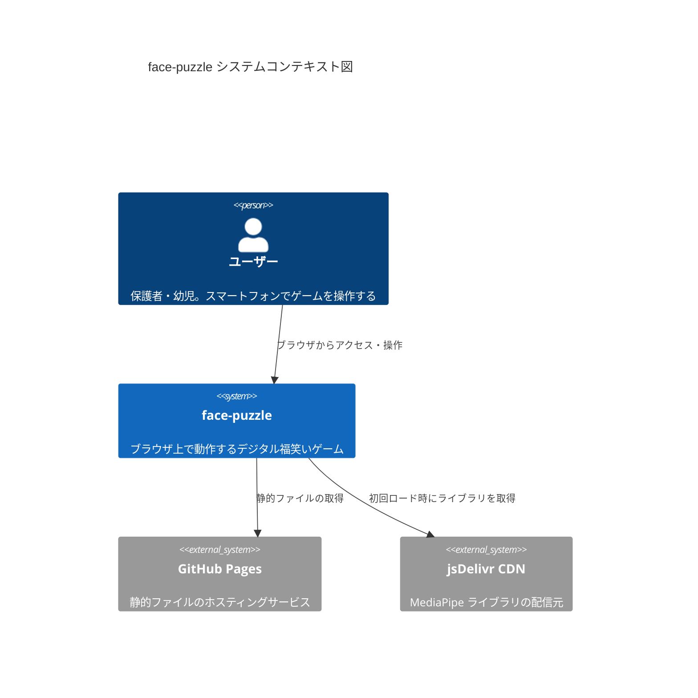
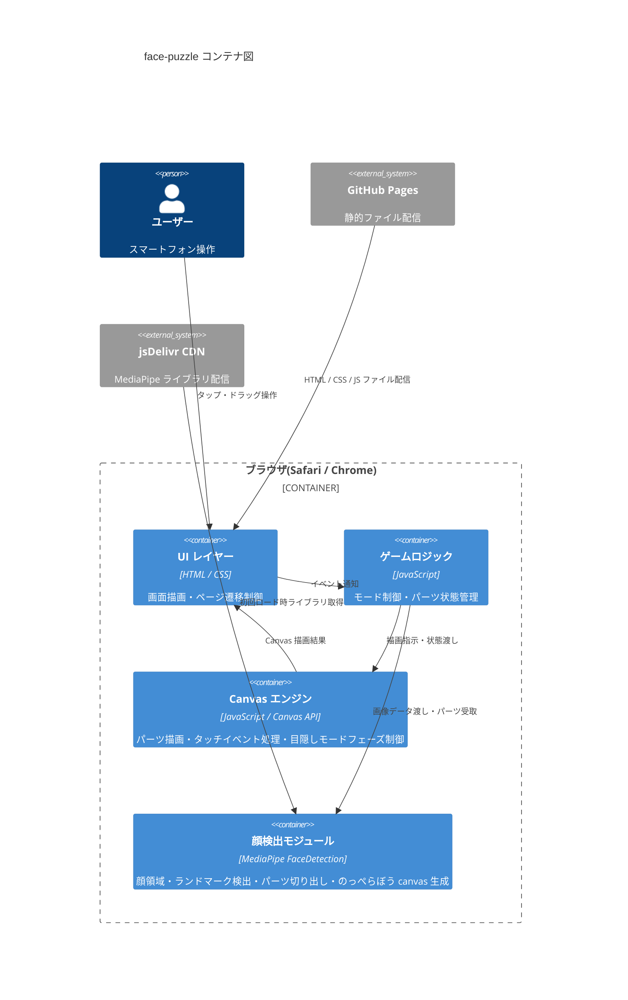
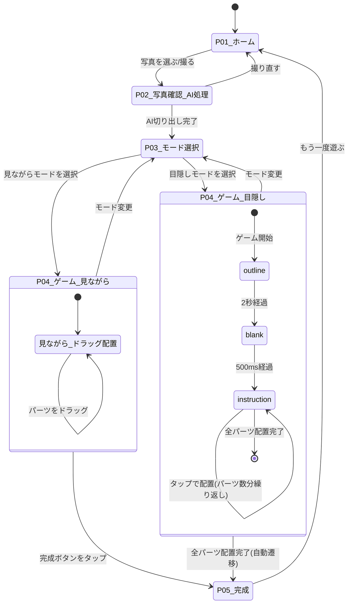
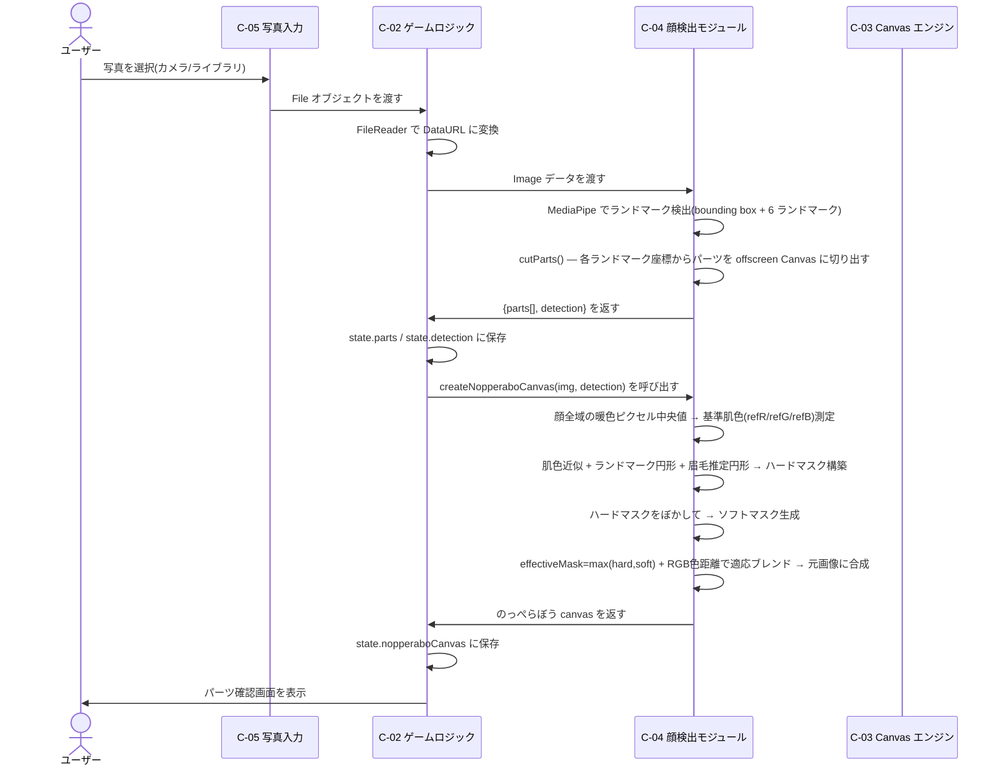
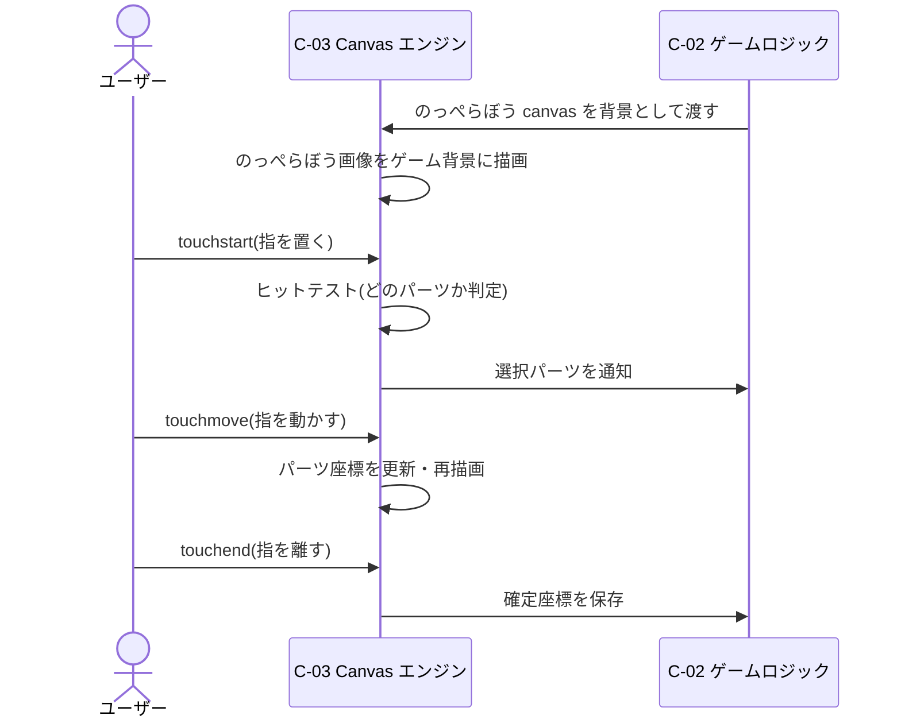
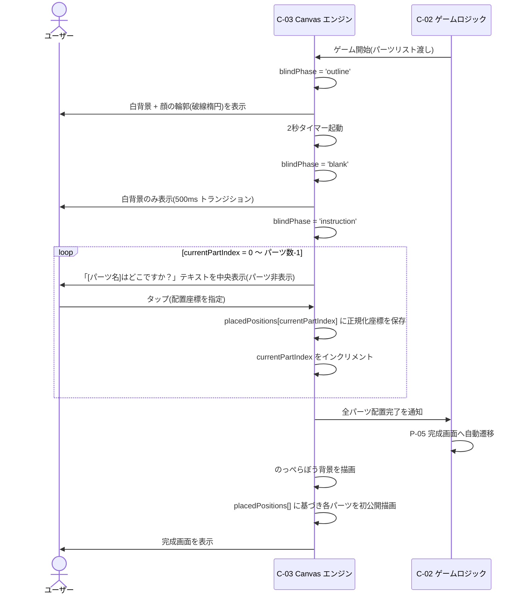

# アーキテクチャ設計書 — face-puzzle

## §1. はじめに

### 1.1 目的

本文書は face-puzzle の技術的な構造・構成要素・設計上の判断根拠を定義するものである。
本文書は実装フェーズの入力として機能し、開発者が一貫した設計判断を行うための基準を提供する。

### 1.2 対象読者

本文書は face-puzzle の実装者および保守担当者を対象とする。

### 1.3 参照文書

| 文書 ID | 文書名 | 場所 |
|---|---|---|
| SRS-face-puzzle-001 | 要件定義書 — face-puzzle | docs/01-requirements.md |

---

## §2. 用語定義

| 用語 | 定義 |
|---|---|
| SPA | Single Page Application。1 枚の HTML で画面遷移をすべて JavaScript で制御するアーキテクチャスタイル |
| Canvas | HTML5 が提供する 2D 描画領域要素。ピクセル単位の描画・画像合成が可能 |
| MediaPipe | Google が提供する機械学習推論ライブラリ。本システムでは顔検出モデルを使用する |
| CDN | Content Delivery Network。ライブラリを世界各地のサーバーから配信する仕組み。初回ロード時にダウンロードされる |
| ADR | Architecture Decision Record。設計上の判断とその根拠を記録する文書 |
| SAD | Software Architecture Document。本文書の文書種別 |
| のっぺらぼう canvas | 顔表面の特徴(目・鼻・口・眉毛・眼鏡など)を除去し、肌色のぼかし合成で滑らかに塗り潰した画像を保持する offscreen Canvas。見ながらモードの背景および目隠しモードの完成画面背景として使用する |
| nopperaboTransform | のっぺらぼう canvas をスクリーンに cover スタイルで描画するときの座標変換情報。`{sx, sy, scale}` の形式で保持し、パーツ配置座標・顔ガイド楕円のスクリーン変換に使用する |
| blindPhase | 目隠しモードにおけるゲーム内フェーズ識別子。'outline' / 'blank' / 'instruction' の 3 値をとる |

---

## §3. アーキテクチャ概観

### 3.1 アーキテクチャスタイル

本システムは **サーバーレス SPA(Static Web Application)** として実装する。
バックエンドサーバーを持たず、すべての処理をブラウザ内で完結させる。
GitHub Pages がビルド不要の静的ファイルを配信し、AI 顔検出処理も MediaPipe をブラウザ内で実行する。

### 3.2 C4 Level 1 — システムコンテキスト図



### 3.3 C4 Level 2 — コンテナ図



---

## §4. コンポーネント構成

| ID | コンポーネント名 | 責務 | 使用技術 | 対応 FR |
|---|---|---|---|---|
| C-01 | UI レイヤー | 各画面の HTML/CSS 構造を提供する。画面間遷移を制御する | HTML5, CSS3 | FR-003, FR-005, FR-006, FR-007 |
| C-02 | ゲームロジック | 選択モードの保持・画面遷移トリガー・パーツ一覧の状態管理を行う。のっぺらぼう canvas を state に保持する | Vanilla JavaScript (ES2020) | FR-003, FR-006, FR-007 |
| C-03 | Canvas エンジン | 見ながらモードではのっぺらぼう画像を cover スタイルで背景描画し、その上でパーツを nopperaboTransform.scale 倍率でドラッグ配置処理する。目隠しモードでは blindPhase('outline' → 'blank' → 'instruction')のフェーズ遷移を制御し、outline フェーズの顔ガイド破線楕円を nopperaboTransform 経由で実際の顔座標に整合させる。全パーツ配置完了後に完成画面へ自動遷移する。完成画面ではのっぺらぼう背景の上に各パーツを保存済み正規化タップ座標へ描画して初公開する | Canvas API, Touch Events API | FR-004, FR-005, FR-007 |
| C-04 | 顔検出モジュール | 入力画像から顔ランドマークを検出し、各パーツを Canvas に切り出す(`detectParts()`)。パーツは眉×2・目×2・鼻×1・口×1 の計 6 種。眉は目ランドマークを `faceH×0.13` 上方にずらした推定座標を使用し、切り出し後に `applyEllipticalMask()` でフェザー付き楕円形状に整形する。`createNopperaboCanvas()` は①顔全域の暖色ピクセル中央値で基準肌色を測定、②肌色近似 + ランドマーク円形 + 眉毛推定円形でハードマスクを構築、③ハードマスクをぼかしてソフトマスクを生成、④ `effectiveMask = max(ハード, ソフト)` かつ RGB 色距離に基づく適応ブレンド(肌色類似ピクセルは BASE_BLEND=0.75、眼鏡・眉毛など色距離が大きいピクセルはブレンド率 1.0)で元画像に合成する 4 段階処理でのっぺらぼう canvas を生成し呼び出し元へ返す | MediaPipe FaceDetection (CDN) | FR-002, FR-008 |
| C-05 | 写真入力モジュール | `<input type="file">` 経由でカメラ撮影またはライブラリから画像を取得する | HTML File API, FileReader API | FR-001 |

---

## §5. 画面遷移

### 5.1 画面一覧

| 画面 ID | 画面名 | 説明 |
|---|---|---|
| P-01 | ホーム画面 | アプリ起動時の入口。写真取得ボタンを配置する |
| P-02 | 写真確認・AI 処理画面 | 取得した写真を表示し、AI パーツ切り出しおよびのっぺらぼう canvas 生成を実行する |
| P-03 | モード選択画面 | 「見ながら置くモード」と「目隠し風モード」を選択する |
| P-04 | ゲーム画面 | Canvas 上でパーツをドラッグまたはタップして配置する |
| P-05 | 完成画面 | 配置結果を全画面表示する |

### 5.2 画面遷移図



---

## §6. データフロー

### 6.1 主要シーケンス — 写真取得から AI 切り出しおよびのっぺらぼう canvas 生成まで



### 6.2 主要シーケンス — ゲームプレイ(見ながらモード・ドラッグ配置)



### 6.3 主要シーケンス — ゲームプレイ(目隠しモード・タップ配置)



### 6.4 データ保持方針

本システムは外部データストアを持たない。すべての状態は JavaScript のメモリ上に保持され、ページリロードまたはセッション終了で消去される。これにより NFR-006(セッション終了後のデータ削除)および NFR-007(外部送信なし)を構造的に実現する。

主要な状態オブジェクトを以下に示す。

| 変数 | 保持場所 | 内容 |
|---|---|---|
| `state.nopperaboCanvas` | C-02 ゲームロジック(グローバル状態) | のっぺらぼう画像を保持する offscreen Canvas |
| `state.parts[]` | C-02 ゲームロジック(グローバル状態) | 切り出したパーツ画像の配列(計 6 要素)。各要素は `{name, blindLabel, canvas}` を持つ。眉パーツは目ランドマークに `yOff=-0.13` を適用した推定座標から切り出す。`blindLabel` は目隠しモード指示文用のユーザー視点表現(例: "向かって左の眉") |
| `state.detection` | C-02 ゲームロジック(グローバル状態) | MediaPipe の生検出結果。`boundingBox` および `landmarks[]` を含む。のっぺらぼう canvas 生成および顔ガイド描画に使用する |
| `state.mode` | C-02 ゲームロジック(グローバル状態) | 選択中のゲームモード('look' / 'blind') |
| `nopperaboTransform` | C-03 Canvas エンジン(ローカル変数) | のっぺらぼう canvas の cover スタイル描画変換情報。`{sx, sy, scale}` 形式。パーツ描画倍率・ヒットテスト・顔ガイド座標変換に共用する |
| `blindPhase` | C-03 Canvas エンジン(ローカル変数) | 目隠しモードのフェーズ識別子('outline' / 'blank' / 'instruction') |
| `currentPartIndex` | C-03 Canvas エンジン(ローカル変数) | 現在配置中のパーツ番号 |
| `placedPositions[]` | C-03 Canvas エンジン(ローカル変数) | タップ位置の正規化座標配列。`{xNorm, yNorm}` (0〜1 の範囲)で保存し、完成画面描画時に Canvas サイズを乗算して実座標に変換する |

---

## §7. 技術スタック

| 層 | 技術 | バージョン | 選定理由 | ADR 参照 |
|---|---|---|---|---|
| マークアップ | HTML5 | Living Standard | 標準仕様。追加ツール不要 | — |
| スタイル | CSS3 | Living Standard | 標準仕様。追加ツール不要 | — |
| ロジック | Vanilla JavaScript | ES2020 | フレームワーク学習コスト不要。資料豊富 | ADR-001 |
| AI 顔検出 | MediaPipe FaceDetection | 0.1.x (CDN) | ブラウザ内完結・無償・Google 公式 | ADR-002 |
| ホスティング | GitHub Pages | — | 無償・静的ファイル配信・CI 不要 | ADR-003 |
| ライブラリ配信 | jsDelivr CDN | — | MediaPipe の npm パッケージを CDN 経由で利用 | ADR-002 |

---

## §8. 品質特性の実現方針

SRS §6 の非機能要件と実現手段を対応づける。

| NFR ID | 要件内容 | 実現方針 |
|---|---|---|
| NFR-001 | ドラッグ追従遅延 p95 ≤ 100ms | Canvas の requestAnimationFrame ループで毎フレーム再描画し、touchmove イベントで即座に座標更新する |
| NFR-002 | AI 切り出し完了 p95 ≤ 10s | MediaPipe モデルをページ読み込み時にプリロードし、処理中はスピナーを表示してユーザーに進捗を伝える。`createNopperaboCanvas()` は同一の検出結果を再利用するため追加処理時間はほぼ生じない |
| NFR-003 | 操作対象 ≥ 60px × 60px | Canvas 上のパーツ描画サイズおよびヒットテスト領域を 60px 以上に設定する。目隠しモードのタップ操作では明示的なヒットテストを行わないため本要件は適用外とする |
| NFR-004 | 文字読解ゼロのゲームプレイ | ゲーム操作に必要なすべての UI 要素にアイコンまたは絵文字を使用し、テキストラベルに依存しない設計とする。目隠しモードの「[パーツ名]はどこですか？」テキストは幼児向け音声読み上げとの組み合わせを前提とし、テキスト単独への依存は避ける |
| NFR-005 | クラッシュ率 ≤ 1% | try-catch による AI 処理エラーハンドリングを実装し、エラー時はホーム画面へフォールバックする |
| NFR-006 | セッション終了後のデータ削除 | データをメモリ上のみに保持し、localStorage / IndexedDB への書き込みを行わない |
| NFR-007 | 顔写真の外部送信禁止 | AI 処理をすべてブラウザ内の MediaPipe で完結させ、ネットワーク送信を行うコードを実装しない |

---

## §9. 配置構成

```
[スマートフォン ブラウザ]
    |
    | HTTPS
    |
[GitHub Pages]
    ├── index.html
    ├── style.css
    ├── js/
    │   ├── main.js        (C-02: ゲームロジック)
    │   ├── canvas.js      (C-03: Canvas エンジン)
    │   └── faceDetect.js  (C-04: 顔検出モジュール)
    └── assets/
        └── (パーツ素材等、必要に応じて)

[jsDelivr CDN]          --- 初回ロード時のみ ---→ [ブラウザ内 MediaPipe]
```

サーバーサイドコンポーネントは存在しない。GitHub Pages はビルドプロセスなしで静的ファイルをそのまま配信する。

---

## §10. ディレクトリ構造

```
face-puzzle/
├── docs/
│   ├── 01-requirements.md    # SRS
│   ├── 02-architecture.md    # 本文書 (SAD)
│   ├── _phase.md             # 現在フェーズ管理
│   └── adr/
│       ├── ADR-001-vanilla-js.md
│       ├── ADR-002-mediapipe.md
│       └── ADR-003-github-pages.md
├── index.html                # エントリポイント・全画面の HTML 構造
├── style.css                 # グローバルスタイル
├── js/
│   ├── main.js               # 画面遷移・モード状態管理 (C-02)
│   ├── canvas.js             # Canvas 描画・タッチイベント・目隠しフェーズ制御 (C-03)
│   └── faceDetect.js         # MediaPipe 呼び出し・パーツ切り出し・のっぺらぼう canvas 生成 (C-04)
├── assets/
│   └── (必要に応じて追加)
└── README.md
```

---

## §11. 設計上の制約とトレードオフ

| # | 制約・トレードオフ | 影響 | 対応方針 |
|---|---|---|---|
| T-001 | MediaPipe の初回ロードに数秒かかる | ユーザーが待ち時間を感じる可能性がある | ページ読み込み時にバックグラウンドでプリロードし、ロード完了まで写真選択を無効化する |
| T-002 | ブラウザ内 AI 処理のため端末性能に依存する | 低スペック端末では NFR-002 の 10s 閾値を超える可能性がある | 対象端末(iOS / Android の現行機)では許容範囲内と判断する |
| T-003 | サーバーレス構成のため画像の永続保存ができない | セッション終了で状態がリセットされる | OOS-001 で完成画像の保存はスコープ外とされているため問題なし |
| T-004 | Vanilla JavaScript のため大規模化時の保守コストが増加する | 機能追加時のコード管理が複雑化する | 本システムは小規模・単機能であり、フレームワーク導入のオーバーヘッドを回避することを優先する |
| T-005 | 目隠しモードではタップ座標を正規化して保持するため、完成画面描画時に Canvas サイズとの再マッピングが必要になる | Canvas リサイズ時に座標ずれが生じる可能性がある | ゲーム中は Canvas サイズを固定し、リサイズイベントを抑制する |

---

## §12. 未決事項

| ID | 内容 | 期限 |
|---|---|---|
| TBD-001 | MediaPipe FaceDetection のランドマーク精度が各パーツ切り出しに十分かの実装検証 | 実装フェーズ序盤 |
| TBD-002 | NFR-002 の 10s 閾値を現行 iOS / Android 端末で満たせるかのプロトタイプ計測 | 実装フェーズ序盤 |
| ~~TBD-003~~ | ~~「耳」パーツが MediaPipe FaceDetection で検出可能かの確認~~ | **解決済み(2026-05-03)**:耳ランドマーク(kpIndex 4/5)は検出精度が不安定なため、パーツセットを目(左右)・鼻・口の 4 点に確定した |
| ~~TBD-004~~ | ~~のっぺらぼう canvas 生成に使用する肌色の RGB 値の決定~~ | **解決済み(2026-05-10)**:顔全域の暖色系ピクセル(r>g かつ r>b、輝度 50〜240)を収集して各チャンネルの中央値を基準肌色として動的に算出する方式を採用。額固定サンプリングより照明ムラへの耐性が高い |
| ~~TBD-005~~ | ~~outline フェーズの破線楕円のサイズ・形状の決定方針~~ | **解決済み(2026-05-03)**:`(bb.xCenter, bb.yCenter)` を nopperaboTransform で変換したスクリーン座標に描画。半径は `bb.width/2 * nc.width * scale`(水平)・`bb.height/2 * nc.height * scale`(垂直) |

---

## §13. リスク

| ID | リスク | 発生確率 | 影響度 | 対応策 |
|---|---|---|---|---|
| R-001 | MediaPipe が対象ブラウザ(iOS Safari)で正常動作しない | 中 | 高 | 実装フェーズ序盤で iOS Safari での動作確認を最優先で実施する |
| R-002 | CDN 障害により MediaPipe ライブラリが取得不可になる | 低 | 高 | 本番リリース時にライブラリファイルをリポジトリに同梱する対策を検討する |
| R-003 | 低照度・横向きなど撮影条件が悪い写真でのパーツ検出失敗 | 中 | 中 | エラー時に「もう一度撮影」へ誘導するフォールバック UI を実装する |
| R-004 | のっぺらぼう canvas の除去精度が低く、顔の特徴が残る・境界が不自然に見える | 低 | 中 | 顔全域中央値による基準肌色測定 + ハード/ソフトマスク二重構造 + RGB 色距離に基づく適応ブレンド(肌色類似: BASE_BLEND=0.75・非肌色: blend=1.0)の 4 段階アルゴリズムで対応済み。照明条件が極端な写真ではリトライを促すフォールバック UI で対処する |

---

## §14. 改訂履歴

| バージョン | 日付 | 変更内容 | 変更者 |
|---|---|---|---|
| 0.1.0 | 2026-05-02 | 初版作成 | architect-coach |
| 0.2.0 | 2026-05-03 | 仕様変更を反映(のっぺらぼう背景・見ながらモード改修・目隠しモード完全リデザイン) | architect-coach |
| 0.3.0 | 2026-05-05 | 実装確定内容を反映(のっぺらぼう 6 段階アルゴリズム詳細・nopperaboTransform・state.detection・blindLabel・TBD-003〜005 解決) | architect-coach |
| 0.4.0 | 2026-05-10 | 眉毛パーツ追加・のっぺらぼうアルゴリズム刷新(顔全域中央値サンプリング・適応ブレンド・楕円マスク・TBD-004 解決内容更新・R-004 対応策更新) | architect-coach |
